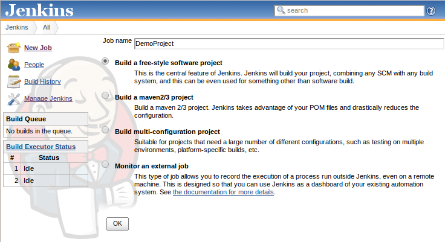
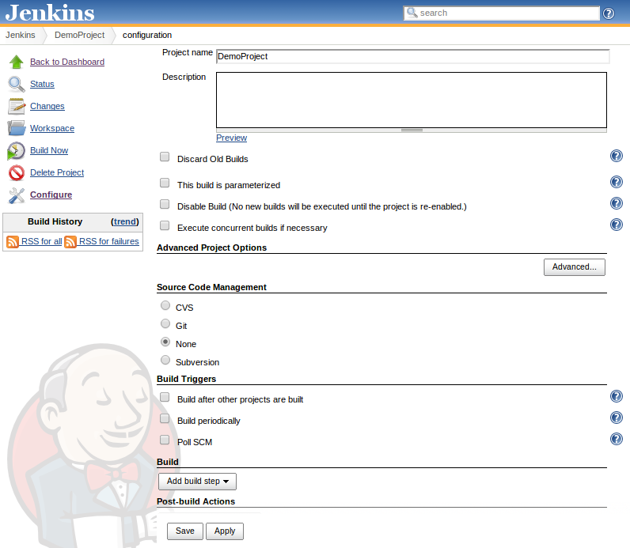
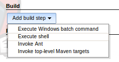
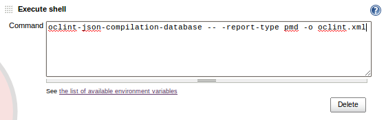
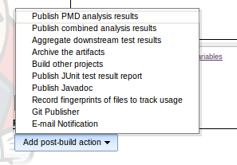
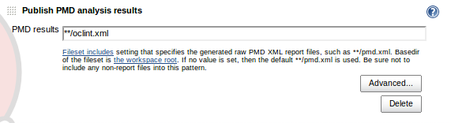
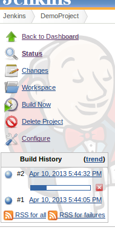
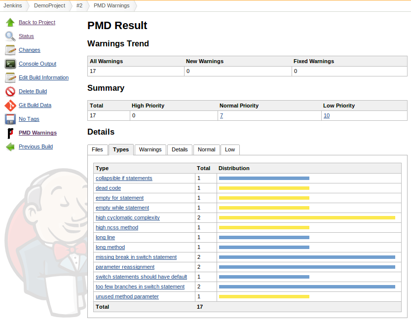

Using OCLint with Jenkins CI
============================

This document shows how to integrate OCLint into Jenkins CI, and render the graphic report by the cooperation between Jenkins' PMD Plugin and OCLint's PMD reporter.

Prerequisite
------------

* `Jenkins CI <http://jenkins-ci.org/>`_
* `PMD Plugin for Jenkins CI <https://wiki.jenkins-ci.org/display/JENKINS/PMD+Plugin>`_
* Knowing how to configure Jenkins to run `continuous integration <http://martinfowler.com/articles/continuousIntegration.html>`_ for the project
* Knowing how to generate ``compile_commands.json`` for the project

  * Read other guides in this chapter for references

* `oclint Manual <../manual/oclint.html>`_
* `oclint-json-compilation-database Manual <../manual/oclint-json-compilation-database.html>`_

Background
----------

From the very beginning of OCLint project, we have always taken continuous integration into serious consideration. OCLint facilitates this process a lot. It generates the certain type of report as artifact, and it fails your build if any level of violations exceeds the threshold.

In order to utilize the Jenkins CI, we have introduced the PMD reporter that converts the analysis results into the format very close to PMD reports, so that the PMD plugin inside Jenkins can easily picks up this output, categorizes and renders graphic reports for us.

The idea was originally developed by Stephan Esch in his `blog post <http://maplesteve.com/2013/03/10/jenkins-pmd-analysis-for-objective-c-with-oclint>`_ along with his contribution of writing ``PMDReporter`` for us.

Setting up Project
------------------

* Create a new free-style project

* Set up adequate steps for continuously building the project

Configuring OCLint and PMD Plugin
---------------------------------

* Add a new build step as an execute shell

* Set up command used for OCLint analysis

  * In addition to the script shown in the following screenshot, we may also need to write the ``compile_commands.json`` generation commands in advance.
  * In some cases, ``oclint`` binary suits better than ``oclint-json-compilation-database``
  * We need to set the report type to pmd
  * Give a name to the output artifact, we will need this file in the following step

* Add a new post-build action, and choose ``Publish PMD analysis results``

* Enter the output artifact name that matches previous step

Running Analysis
----------------

Same as running regular Jenkins build, it might be triggered by time, by pinging the source control management, and manually. you can see the build history and current build progress.

Monitoring Results
------------------

When the build finishes successfully, we now can go into that build. On the left sidebar, click ``PMD Warnings`` to see the report. Following is a screenshot of sorting the results by the type of the rules.

