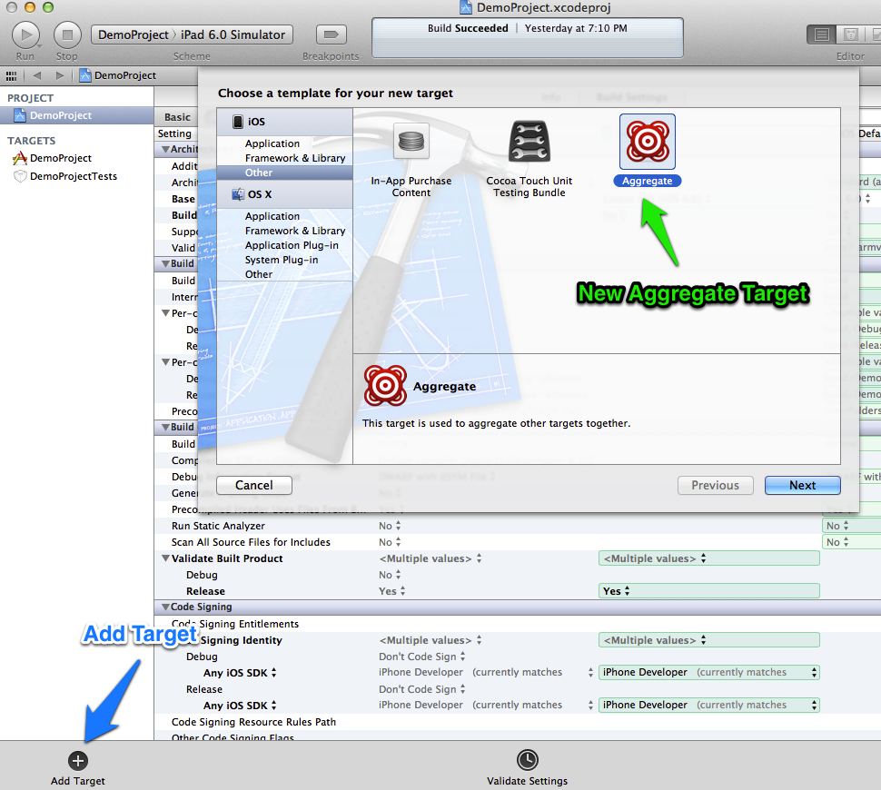
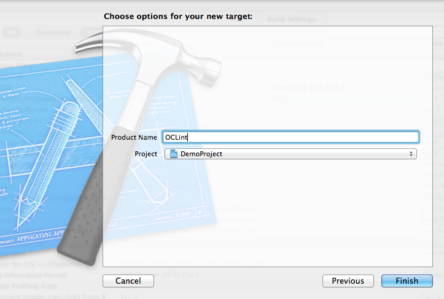
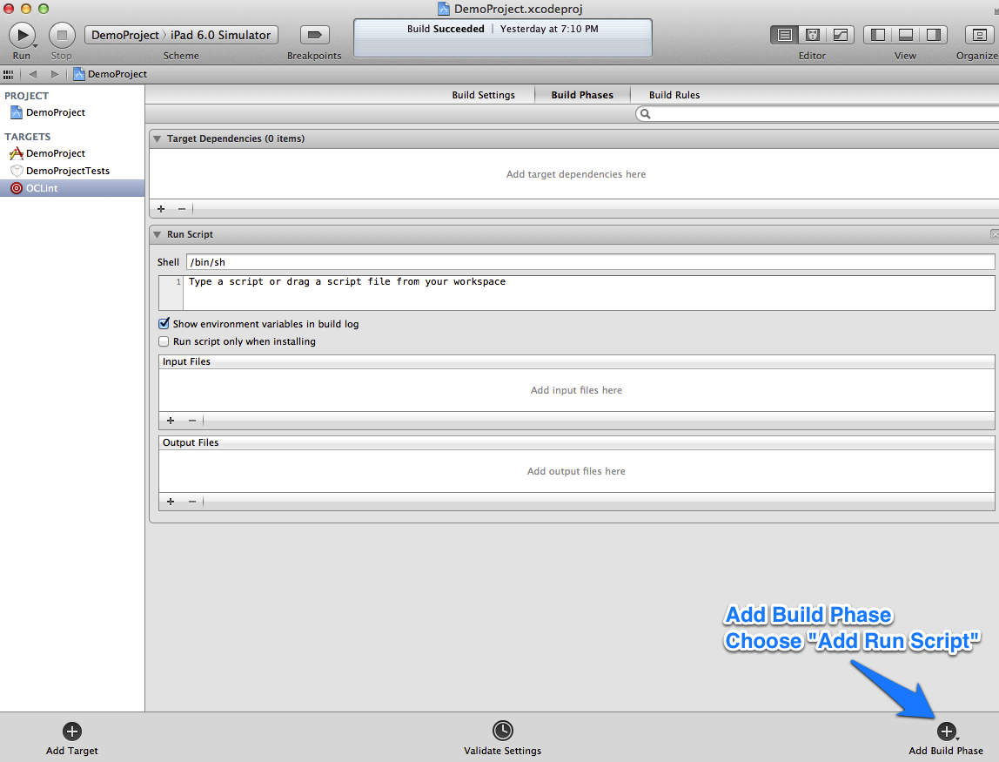
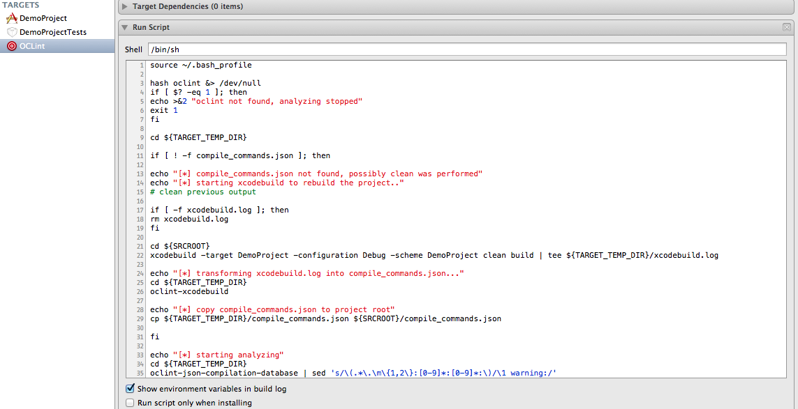
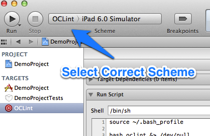
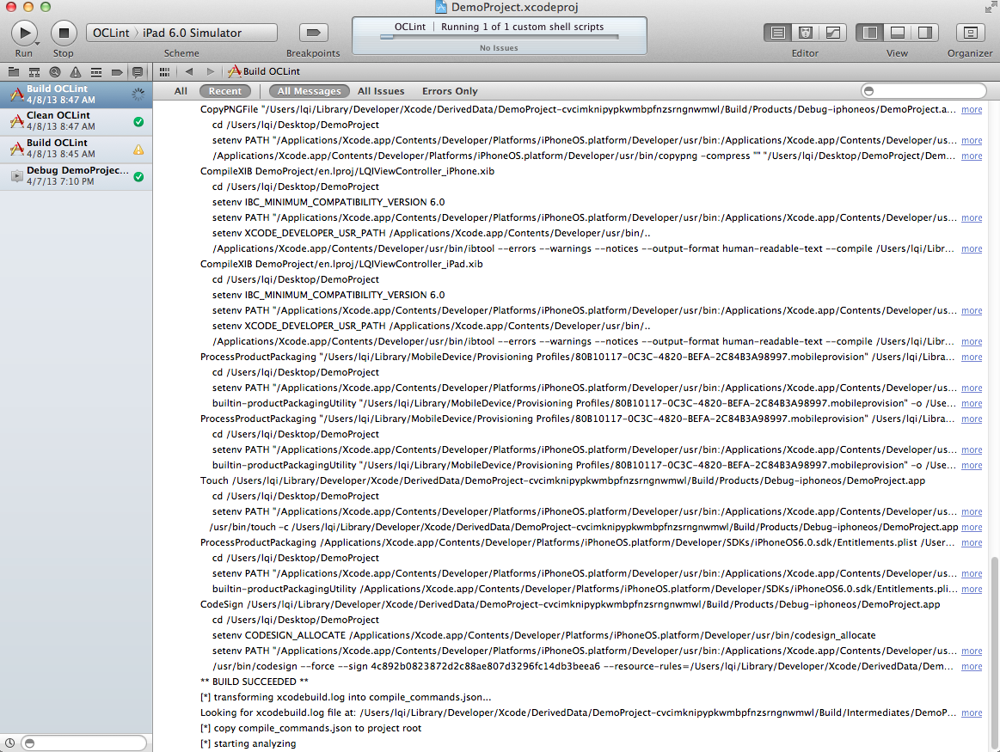
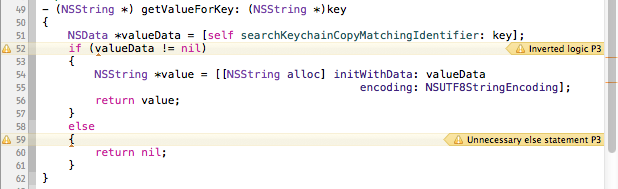

Using OCLint in Xcode
=====================

This document shows one solution of using OCLint to analyze the code quality of a Xcode project.

Prerequisite
------------

* `oclint-xcodebuild Manual <../manual/oclint-xcodebuild.html>`_
* Apple's official `xcodebuild Manual Page <https://developer.apple.com/library/mac/#documentation/Darwin/Reference/ManPages/man1/xcodebuild.1.html>`_
* `Using OCLint with xcodebuild <xcodebuild.html>`_

or

* `Using OCLint with xctool <xctool.html>`_

Background
----------

This idea was originally posted in `this blog <http://gavrix.wordpress.com/2013/02/28/integrating-oclint-in-xcode/>`_. We hope to share it with more developers, and hope to motivate more ideas.

Setting up Target
-----------------

* Add a new target in the project, and choose ``Aggregate`` as the template.

* Name the new target, here we simply call it "OCLint", you could have more than one targets that focus on different aspects of the code analysis.

* Add a new build phase in the target we just created. Choose ``And Run Script`` for the phase type.

* In the script editor, we could enter the script which does the real work. We can also modify the script from this very `generic version <https://gist.github.com/lqi/5358513>`_. We may need to change the ``xcodebuild`` options to use a particular scheme or target. In addition, based on the `discussions <xcodebuild.html#discussions>`_ we had, we can decide whether to use ``clean`` and ``dry run`` features.

* For ``xctool`` users, the script can be largely simplified to something like `this <https://gist.github.com/lqi/5705477>`_

Running Analysis
----------------

* Choose the correct build scheme, here we choose ``OCLint``.

* Click to build, or use the shortcut ``Command+B``.

* When the progress bar scrolls to the very right, the analysis is done, then we can check out the analysis results same as compile warnings.

