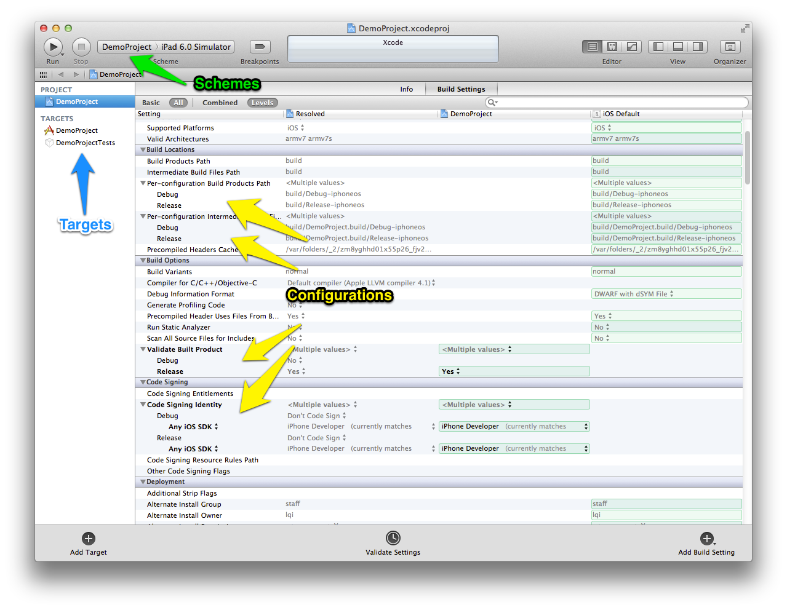

Using OCLint with xcodebuild
============================

This document goes through the happy path of using OCLint to analyze the code quality of a Xcode project with xcodebuild.

Prerequisite
------------

* `oclint Manual <../manual/oclint.html>`_
* `oclint-json-compilation-database Manual <../manual/oclint-json-compilation-database.html>`_
* `oclint-xcodebuild Manual <../manual/oclint-xcodebuild.html>`_
* Apple's official `xcodebuild Manual Page <https://developer.apple.com/library/mac/#documentation/Darwin/Reference/ManPages/man1/xcodebuild.1.html>`_

Background
----------

OCLint recognizes a file called ``compile_commands.json`` to figure out the compiler options for parsing each file. For Xcode users, since all these compiler options are implicitly configured in Xcode build settings, we can see what actually happens when we invoke ``xcodebuild`` in terminal. Our approach is to capture the log of xcodebuild output, use ``oclint-xcodebuild`` to extract the adequate compiler options, convert them into JSON Compilation Database format, and save it into ``compile_commands.json`` file. Then we can use ``oclint-json-compilation-database`` to run analysis.

Running xcodebuild
------------------

Running ``xcodebuild`` is a quite simple task to some people by figuring out the correct options for ``xcodebuild``. However, some people may feel it's not intuitive, so be patient, and take your time. You may find many online tutorials and blog posts that may help.

Basically, let's say we have a ``DemoProject``, to know all the options we have, enter ``xcodebuild -list``:

.. code-block:: bash

  $ xcodebuild -list
  Information about project "DemoProject":
      Targets:
          DemoProject
          DemoProjectTests

      Build Configurations:
          Debug
          Release

      If no build configuration is specified and -scheme is not passed then "Release" is used.

      Schemes:
          DemoProject

We can map these options back to the Xcode GUI:

Based on our choices in Xcode, we can set the corresponding options for ``xcodebuild``. For instance, we can build our ``DemoProject`` project with

.. code-block:: bash

  xcodebuild -target DemoProject -configuration Debug -scheme DemoProject

We should see detail ``xcodebuild`` invocations with a ``** BUILD SUCCEEDED **`` in the end. Great!

There are more options for ``xcodebuild``, like ``workspace``, ``arch``, ``sdk``, etc, we can apply them when necessary.

Capturing Output
----------------

We need to save the ``xcodebuild`` output to a log file, by convention, name it ``xcodebuild.log``. We can use ``xcodebuild <options> | tee xcodebuild.log`` to pipe every line of the output to ``xcodebuild.log`` file.

Running oclint-xcodebuild
-------------------------

By running ``oclint-xcodebuild`` in the project root folder, a ``compile_command.json`` file should be generated.

Running oclint-json-compilation-database
----------------------------------------

Excellent! Last step, we can kick off code analysis by ``oclint-json-compilation-database``. We can filter the JSON compilation database, and analyze on the files we are interested. We can also change the OCLint behaviors to meet our specific requirements.

Discussions
-----------

Clean Build
^^^^^^^^^^^

If a source file has been built by ``xcodebuild``, and it's not been modified since last build, then it might not be compiled again when you invoke ``xcodebuild`` the second time. In other words, if it happens, this file won't be shown in the log. So we won't see it in the ``compile_commands.json``. To avoid that, use clean build by removing all build products and intermediate files from the build directory.

However, cleaning and building the entire project takes longer time, especially for those big projects. In this case, if file structure hasn't been changed, and build settings haven't been modified, then it's okay to keep the existing ``xcodebuild.log`` and ``compile_commands.json`` to save time.

If the ``xcodebuild`` build can be guaranteed to be successful with the options specified, then we could also use ``-dry-run`` option to *build* the project without actually running the commands, so that we can still capture the ``xcodebuild`` log but with reduced time.

Save to Repository
^^^^^^^^^^^^^^^^^^

``compile_commands.json`` is platform sensitive. Whenever the environment has been changed, for example, upgrading Mac OS, upgrading Xcode version, switch to another SDK, and so on, please remove the existing ``xcodebuild.log`` and ``compile_commands.json``, capture xcodebuild log again with the updated options, and re-generate new ``compile_commands.json``.

Checking ``compile_commands.json`` into source code repository is not necessary. Instead, always generate a new ``compile_comamnds.json`` when anything changes.

However, we could write the entire process into a bash script, and check in this script. So that, all developers who work on the project can run this script and generate the ``compile_commands.json`` file that works best for his or her local environment.
